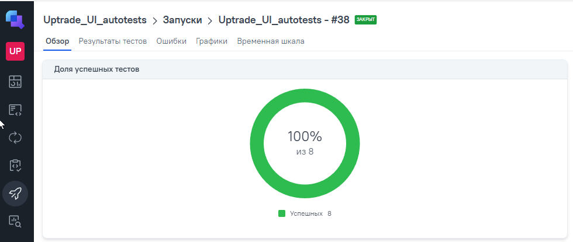
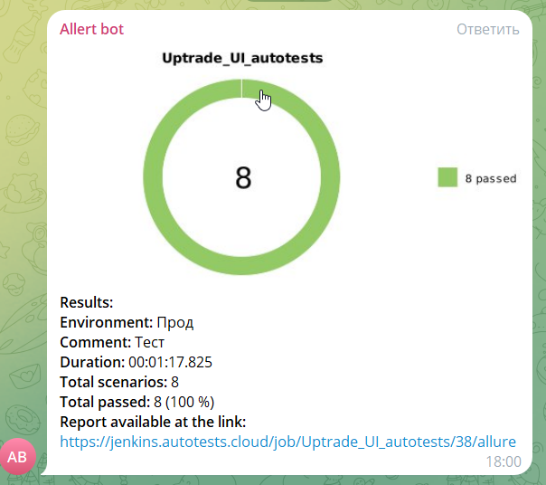

# Проект автоматизации тестирования (WEB) для сайта uptrade.ru 


## Содержание

* <a href="#tests">Тест-кейсы</a>
* <a href="#autotest">Запуск автотестов</a>
* <a href="#jenkins">Сборка Jenkins</a>
* <a href="#joinjenkins">Интеграция с Allure report</a>
* <a href="#allure">Отчет в Allure</a>
* <a href="#testops">Интеграция с Allure TestOps</a>
* <a href="#telegramBot">Уведомления в Telegram bot</a>
* <a href="#video">Видео прохождения тестов</a>

---

<a id="tests"></a>
## <a name="Тест-кейсы">**Тест-кейсы**</a>

Web:

8 тестов проверяют функционал [сайта](https://uptrade.ru/)

 - кликабельность кнопок и соответствие названий основных кнопок требованиям
 - переключение пагинатора на сайте
 - переключение кнопок навигации
 - открытие модального окна с формой ввода
 - закрытие модального окна с формой ввода
 - отображение незаполненного поля, при отправке формы

---

<a id="autotest"></a>
## <a name="Запуск автотестов">**Запуск автотестов**</a>

### Запуск тестов из терминала

Для запуска тестов локально использовать команду ниже:
```
./gradlew clean test -Denv=local
```
Для запуска тестов удаленно использовать команду ниже:
```
./gradlew clean test -Denv=remote
```

---

<a id="jenkins"></a>
## <a name="Сборка Jenkins:">**Сборка Jenkins:**</a>

Тесты запускаются через [Jenkins](https://jenkins.autotests.cloud/job/Uptrade_UI_autotests/)  


Можно выбрать параметры 
- browser
- browser_size
- browser_version

Для запуска тестов необходимо нажать на кнопку "Build". Появится прогресс бар с номером сборки тестов. 

---

<a id="joinjenkins"></a>
## <a name="Интеграция с Allure report:">**Интеграция с Allure report:**</a>

После прохождения тестов, появляется диаграмма прохождения, по которой, в цветовом значении, наглядно видно количество успешных и неуспешных тестов


<a id="allure"></a>
## <a name="Отчет в Allure">**Отчет в Allure**</a>

 При нажатии на тестовый набор, раскрывается названия всех тестов. При нажатии на определенный тест, раскрываются шаги теста с приложенными вложениями
[Allure](https://jenkins.autotests.cloud/job/Uptrade_UI_autotests/38/allure/#suites/159fbffea37b83e5595c727b9006689c/4cbb7e3a792bad4c/)


---

<a id="testops"></a>
## <a name="Интеграция с Allure TestOps">**Интеграция с Allure TestOps**</a>

В [TestOps](https://allure.autotests.cloud/launch/43853/tree?treeId=8884) можно посмотреть диаграмму прохождения тестов



Так же можно посмотреть более подробную информация по тестам


---

<a id="telegramBot"></a>
## <a name="Уведомления в Telegram bot">**Уведомления в Telegram bot**</a>

Для быстрой визуализации отчетности, после выполнения тестов, результат отчета дублируется в Telegram бот:
<p align="center">
    
</p>

---

<a id="video"></a>
## <a name="Видео прохождения тестов">**Видео прохождения тестов**</a>

<p align="center">
   
</p>
